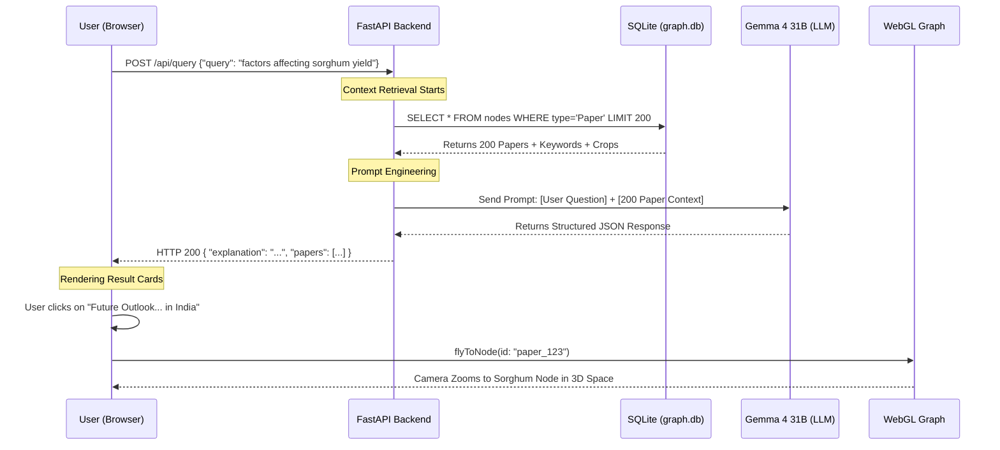

# Life of a Query: "Factors affecting sorghum yield"

This document traces exactly how the system processed your example question.

---

## 1. The Interaction Flow

---

## 2. Deep Dive: The Data Transformation

### Step 1: The Request
You typed: *"What are the factors affecting sorghum yield in semi-arid regions?"*
The frontend sent this to `/api/query`.

### Step 2: Context Gathering (The "R" in RAG)
The backend didn't know the answer yet. It searched the database for the most important papers. It found:
* **Paper 1**: "Genetic mapping of drought tolerance..." (Keywords: SORGHUM, QTL)
* **Paper 2**: "Managing water in rainfed agriculture..." (Keywords: SEMI-ARID, WATER)
* ... it gathered 198 more papers.

### Step 3: The AI "Reading" Pass
It sent all those titles and keywords to **Gemma 4 31B** with these instructions:
> *"Read these 200 papers. Categorize the yield factors into Abiotic and Biotic categories. Match the best papers to the user's question."*

### Step 4: The Intelligent Synthesis
Gemma analyzed the list and realized that:
* **Abiotic factors** in the papers include: Rainfall, Aluminum Toxicity, and Soil Fragility.
* **Biotic factors** include: Stem Borer and Shoot Fly.

It then generated the explanation you saw: *"The identified papers cover a comprehensive range... abiotic factors (unpredictable rainfall...) and biotic factors (pests like the spotted stem borer...)"*

### Step 5: Returning to the Map
Finally, for each paper it recommended, it included its ID. When you click **"Future Outlook..."** in the UI, the browser looks up the coordinates for that paper on the map and "flies" you there. 

**This turns a generic text answer into a traceable visual piece of evidence.**
